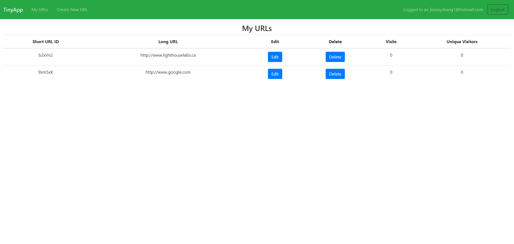
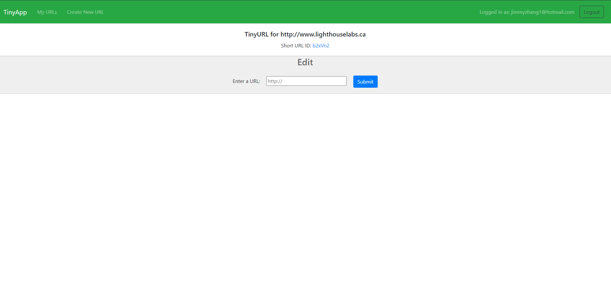
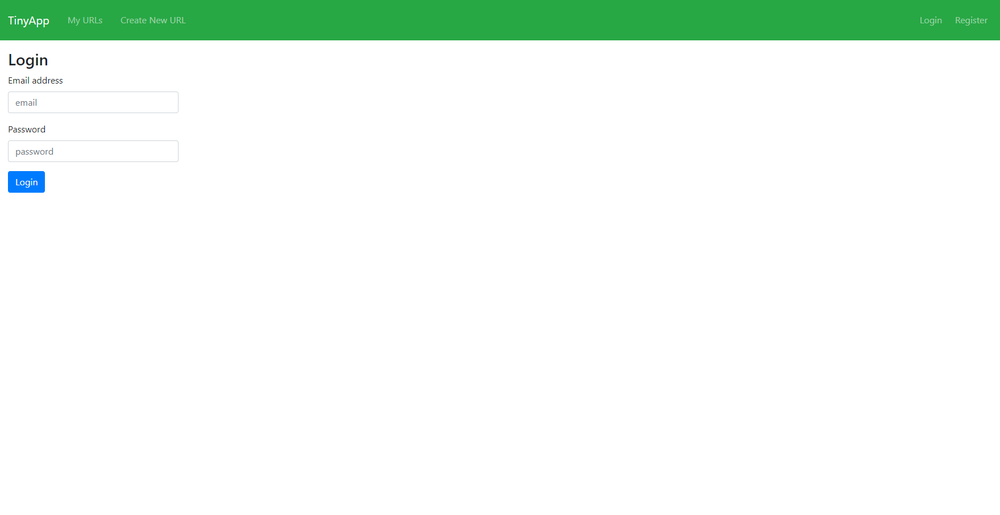

# TinyApp Project

TinyApp is a full stack web application built with Node and Express that allows users to shorten long URLs (à la bit.ly).

## Final Product

Here is our page that shows all of our current shortened URLs. We have the option to edit and delete the link. Also, the website tracks the amount of visits to that page, as well as identifying how many unique users have visited that page.

Next, we can see our edit page, and this gives us the option to edit the long URL. We also have the option of clicking into the short URL, which redirects us to the long URL. In a future version, I will be adding tracking of every visit (timestamps and visitor id).

Lastly, our login page!

## Dependencies

- Node.js
- Express
- EJS
- bcryptjs
- cookie-session

## Getting Started

- Install all dependencies (using the `npm install` command).
- Run the development web server using the `node express_server.js` command.
